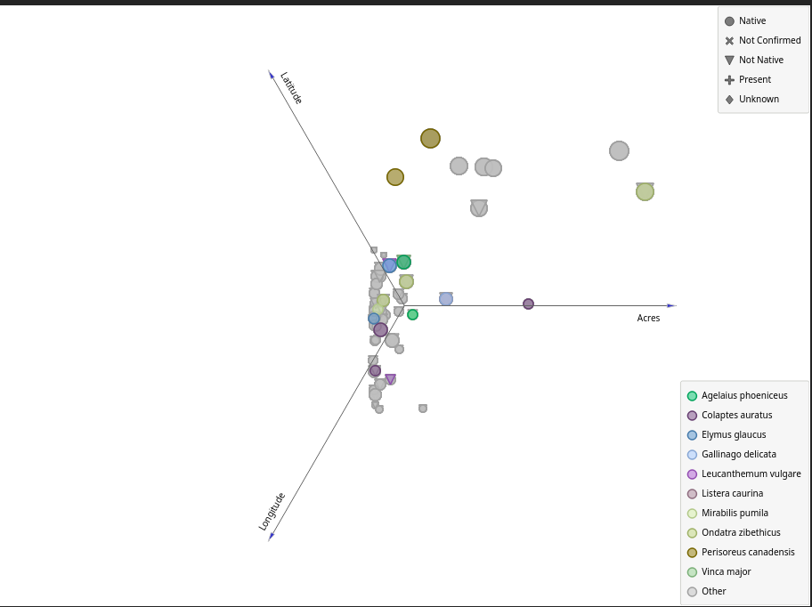

## Tarefa

Utilizando o [Orange](https://orange.biolab.si/) para visualizar os dados do [dataset](https://www.kaggle.com/nationalparkservice/park-biodiversity).

[Meu programa no orange](src/especies.ows)

### Gráfico encontrado para a tarefa

O tamanho está relacionado com o valor da altitude, podemos ver que há uma concentração de exemplares em parques pequenos já que a grande maioria dos parques tem área muito pequena.